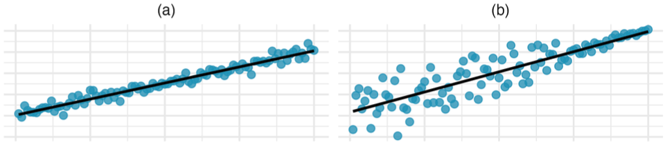
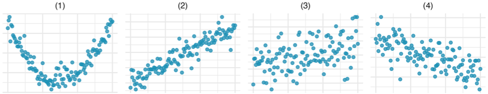

```{r packages, echo=FALSE, message=FALSE, warning=FALSE}
library(tidyverse)
library(unvotes)
library(knitr)
library(broom)
library(patchwork)
library(ggpubr)
library(scales) # label_dollar 
library(quantreg) # rq
library(kableExtra)
library(openintro)
# library(infer)
# library(gghighlight)

hook_output <- knit_hooks$get("output")
knit_hooks$set(output = function(x, options) {
  lines <- options$output.lines
  if (is.null(lines)) {
    return(hook_output(x, options))  # pass to default hook
  }
  x <- unlist(strsplit(x, "\n"))
  more <- "..."
  if (length(lines)==1) {        # first n lines
    if (length(x) > lines) {
      # truncate the output, but add ....
      x <- c(head(x, lines), more)
    }
  } else {
    x <- c(more, x[lines], more)
  }
  # paste these lines together
  x <- paste(c(x, ""), collapse = "\n")
  hook_output(x, options)
})

knitr::opts_chunk$set(comment = NA) # makes it so the ## doesnt appear in output for chunks

# source("../_common.R")
# 
# library(xaringanthemer)
# # style_mono_light(base_color = "#23395b")
# style_mono_accent(base_color = "#23395b")

```


## Instructions
Upload a PDF file, named with your UC Davis email ID and homework number (e.g., ahoriguchi_hw4.pdf), to Gradescope (accessible through Canvas). You will give the commands to answer each question in its own code block, which will also produce output that will be automatically embedded in the output file.  All code used to answer the question must be supplied, as well as written statements where appropriate. 

All code used to produce your results must be shown in your PDF file (e.g., do not use `echo = FALSE` or `include = FALSE` as options anywhere). Rmd files do not need to be submitted, but may be requested by the TA and must be available when the assignment is submitted.

Students may choose to collaborate with each other on the homework, but must clearly indicate with whom they collaborated.

\newpage 

# Problem 1: [IMS] 7.5.1

**Visualizing residuals**. The scatterplots shown below each have a superimposed regression line. If we were to construct a residual plot (residuals versus $x$) for each, describe in words what those plots would look like. (You don't have to construct the residual plot.)

{width="18cm"}


\newpage 

# Problem 2: [IMS] 7.5.7

**Match the correlation, I**. Match each correlation to the corresponding scatterplot.

{width="18cm"}

a. $r = 0.7$
b. $r = 0.45$
c. $r = 0.06$
d. $r = 0.92$


\newpage 

# Problem 3: [IMS] 7.5.24

**Cat weights**. The following regression output is for predicting the heart weight (`Hwt`, in g) of cats from their body weight (`Bwt`, in kg). The coefficients are estimated using a dataset of 144 domestic cats.

```{r}
#| fig-align: center
#| fig-height: 2.5
lm(Hwt ~ Bwt, data=MASS::cats) |> broom::tidy() |> kable(digits=3)

ggplot(MASS::cats, aes(Bwt, Hwt)) +
    geom_point() + 
    theme_minimal() + 
    labs(x = "Body weight (kg)", y = "Heart weight (g)")
```


a. Write out the linear model.
b. Interpret the intercept.
c. Interpret the slope.
d. The $R^2$ of this model is 65%. Interpret $R^2$.
e. Calculate the correlation coefficient.