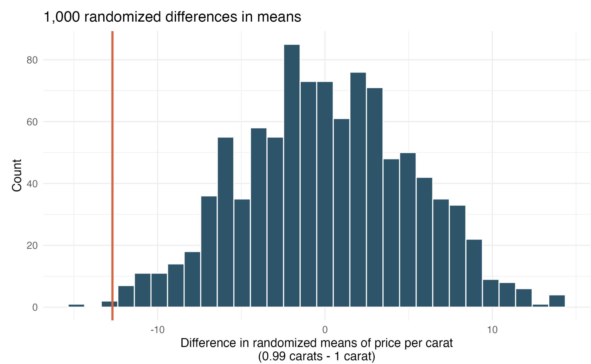
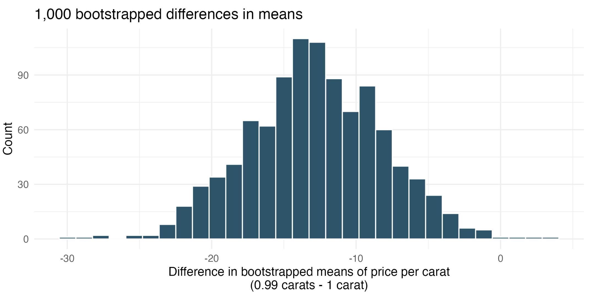
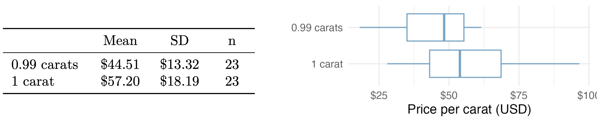
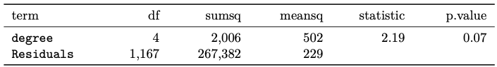
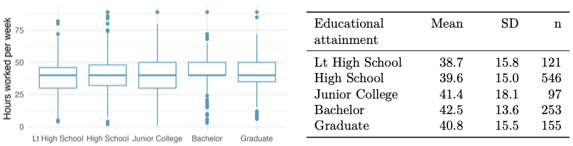

```{r packages, echo=FALSE, message=FALSE, warning=FALSE}
library(tidyverse)
library(unvotes)
library(knitr)
library(broom)
library(patchwork)
library(ggpubr)
library(scales) # label_dollar 
library(quantreg) # rq
library(kableExtra)
library(openintro)
library(infer)
library(gghighlight)

hook_output <- knit_hooks$get("output")
knit_hooks$set(output = function(x, options) {
  lines <- options$output.lines
  if (is.null(lines)) {
    return(hook_output(x, options))  # pass to default hook
  }
  x <- unlist(strsplit(x, "\n"))
  more <- "..."
  if (length(lines)==1) {        # first n lines
    if (length(x) > lines) {
      # truncate the output, but add ....
      x <- c(head(x, lines), more)
    }
  } else {
    x <- c(more, x[lines], more)
  }
  # paste these lines together
  x <- paste(c(x, ""), collapse = "\n")
  hook_output(x, options)
})

knitr::opts_chunk$set(comment = NA) # makes it so the ## doesnt appear in output for chunks

# source("../_common.R")

library(xaringanthemer)
# style_mono_light(base_color = "#23395b")
style_mono_accent(base_color = "#23395b")

```


## Instructions
Upload a PDF file, named with your UC Davis email ID and homework number (e.g., ahoriguchi_hw6.pdf), to Gradescope (accessible through Canvas). You will give the commands to answer each question in its own code block, which will also produce output that will be automatically embedded in the output file.  All code used to answer the question must be supplied, as well as written statements where appropriate. 

All code used to produce your results must be shown in your PDF file (e.g., do not use `echo = FALSE` or `include = FALSE` as options anywhere). Rmd files do not need to be submitted, but may be requested by the TA and must be available when the assignment is submitted.

Students may choose to collaborate with each other on the homework, but must clearly indicate with whom they collaborated.

\newpage 

## Problem 1: [IMS] 20.6.3 Diamonds, randomization test

The prices of diamonds go up as the carat weight increases, but the increase is not smooth. For example, the difference between the size of a 0.99 carat diamond and a 1 carat diamond is undetectable to the naked human eye, but the price of a 1 carat diamond tends to be much higher than the price of a 0.99 carat diamond. We have two random samples of diamonds: 23 0.99 carat diamonds and 23 1 carat diamonds. In order to be able to compare equivalent units, we first divide the price for each diamond by 100 times its weight in carats. That is, for a 0.99 carat diamond, we divide the price by 99 and for a 1 carat diamond, we divide it by 100. Then, we randomize the carat weight to the price values in order simulate the null distribution of differences in average prices of 0.99 carat and 1 carat diamonds. The null distribution (with 1,000 randomized differences) is shown below and depicts the distribution of differences in sample means (of price per carat) if there really was no difference in the population from which these diamonds came.7 (Wickham 2016)

```{r}
#| echo: false
#| out.width: 70%
#| fig.align: center


```

Using the randomization distribution, conduct a hypothesis test to evaluate if there is a difference between the prices per carat of diamonds that weigh 0.99 carats and diamonds that weigh 1 carat. Make sure to state your hypotheses clearly and interpret your results in context of the data. (Wickham 2016)

\newpage 

## Problem 2: [IMS] 20.6.5 Diamonds, bootstrap interval

We have data on two random samples of diamonds: 23 0.99 carat diamonds and 23 1 carat diamonds. Provided below is a histogram of bootstrap differences in means of price per carat of diamonds that weigh 0.99 carats and diamonds that weigh 1 carat. (Wickham 2016)

```{r}
#| echo: false
#| out.width: 70%
#| fig.align: center


```

a. Using the bootstrap distribution, create a (rough) 95% bootstrap percentile confidence interval for the true population difference in prices per carat of diamonds that weigh 0.99 carats and 1 carat.
b. Using the bootstrap distribution, create a (rough) 95% bootstrap SE confidence interval for the true population difference in prices per carat of diamonds that weigh 0.99 carats and 1 carat. (The standard error of the bootstrap distribution is 4.64.)

\newpage 

## Problem 3: [IMS] 20.6.9 and 20.6.11 Diamonds, mathematical test and mathematical interval

We have data on two random samples of diamonds: one with diamonds that weigh 0.99 carats and one with diamonds that weigh 1 carat. Each sample has 23 diamonds. Sample statistics for the price per carat of diamonds in each sample are provided below. 

```{r}
#| echo: false
#| out.width: 70%
#| fig.align: center



# diamonds_ppc <- diamonds |> 
#     filter(carat %in% c(0.99, 1)) |> 
#     mutate(price_per_carat = price/carat, .keep="used") 
# diamonds_ppc |> 
#     group_by(carat) |> 
#     summarize(Mean = mean(price_per_carat), SD = sd(price_per_carat), n=n(), .groups="drop") |> 
#     kable(digits = 2, caption = "Sample statistics for price per carat of diamonds that weigh 0.99 carats and 1 carat") |> 
#     kable_styling(latex_options = "HOLD_position", full_width = FALSE)
# 
# diamonds_ppc |> 
#     mutate(carat = factor(carat, levels = c(1, 0.99), labels = c("1 carat", "0.99 carats"))) |> 
#     ggplot(aes(x=price_per_carat, y=carat)) + 
#     geom_boxplot() + 
#     theme_minimal()
```

a. Conduct a hypothesis test using a mathematical model to evaluate if there is a difference between the prices per carat of diamonds that weigh 0.99 carats and diamonds that weigh 1 carat. Make sure to state your hypotheses clearly, check relevant conditions, and interpret your results in context of the data. (Wickham 2016)
b. Assuming that the conditions for conducting inference using a mathematical model are satisfied, construct a 95% confidence interval for the true population difference in prices per carat of diamonds that weigh 0.99 carats and 1 carat. (Wickham 2016)


\newpage 

## Problem 4: [IMS] 22.5.10 Work hours and education

The General Social Survey collects data on demographics, education, and work, among many other characteristics of US residents. (NORC 2010) Using ANOVA, we can consider educational attainment levels for all 1,172 respondents at once. Below are the distributions of hours worked by educational attainment and relevant summary statistics that will be helpful in carrying out this analysis.


```{r}
#| echo: false
#| out.width: 70%
#| fig.align: center


```

a. Write hypotheses for evaluating whether the average number of hours worked varies across the five groups.
b. Check conditions and describe any assumptions you must make to proceed with the test.
c. Below is the output associated with this test. What is the conclusion of the test?

```{r}
#| echo: false
#| out.width: 80%
#| fig.align: center


```

\newpage

## Problem 5: [IMS] 24.8.17 Beer and blood alcohol content

Many people believe that weight, drinking habits, and many other factors are much more important in predicting blood alcohol content (BAC) than simply considering the number of drinks a person consumed. Here we examine data from sixteen student volunteers at [The] Ohio State University who each drank a randomly assigned number of cans of beer. These students were evenly divided between men and women, and they differed in weight and drinking habits. Thirty minutes later, a police officer measured their blood alcohol content (BAC) in grams of alcohol per deciliter of blood. The scatterplot and regression table summarize the findings. (Malkevitch and Lesser 2008)


```{r}
#| echo: false
#| out.width: 40%
#| fig.align: center

openintro::bac |> 
    ggplot(aes(x = beers, y = bac)) +
    geom_point() + 
    scale_x_continuous(breaks = seq(0, 10, by=2)) +
    theme_minimal() + 
    labs(x="Cans of beer", y="BAC (g/dL)")

lm(bac~beers, data=openintro::bac) |> summary() |> _$coeff |> kable(digits=3)
```

a. Describe the relationship between the number of cans of beer and BAC.
b. Write the equation of the regression line. Interpret the slope and intercept in context.
c. Do the data provide convincing evidence that drinking more cans of beer is associated with an increase in blood alcohol? State the null and alternative hypotheses, report the p-value, and state your conclusion.
d. The correlation coefficient for number of cans of beer and BAC is 0.89. Calculate $R^2$ and interpret it in context.
e. Suppose we visit a bar in our own town, ask people how many drinks they have had, and also measure their BAC. Would the relationship between number of drinks and BAC would be as strong as the relationship found in the Ohio State study? Why?


\newpage

## Problem 6: [IMS] 25.5.3 Cherry trees, collinear predictors

Timber yield is approximately equal to the volume of
a tree, however, this value is difficult to measure without first cutting the tree down. Instead,
other variables, such as height and diameter, may be used to predict a tree’s volume and yield.
Researchers wanting to understand the relationship between these variables for black cherry
trees collected data from 31 such trees in the Allegheny National Forest, Pennsylvania. Height
is measured in feet, diameter in inches (at 54 inches above ground), and volume in cubic feet.5
(Hand 1994) The plots below display the distribution of each of these variables (on the diagonal)
as well as provide information on the pairwise correlations between them.

```{r}
#| echo: false
#| message: false
#| out.width: 70%
#| fig.align: center

openintro::cherry |> 
    GGally::ggpairs() + 
    theme_bw()
```

Also provided below are three regression model outputs: `volume` vs. `diam`, `volume` vs. `height`, and `volume` vs. `height` + `diam`.

```{r}
#| echo: false
#| message: false

openintro::cherry |> 
    lm(volume ~ diam, data=_) |> 
    summary() |> 
    broom::tidy() |> 
    kable(digits = 3, caption = "Volume vs. Diameter")

openintro::cherry |> 
    lm(volume ~ height, data=_) |> 
    summary() |> 
    broom::tidy() |> 
    kable(digits = 3, caption = "Volume vs. Height")

openintro::cherry |> 
    lm(volume ~ height + diam, data=_) |> 
    summary() |> 
    broom::tidy() |> 
    kable(digits = 3, caption = "Volume vs. Height and Diameter")
```

\newpage
a. There are three variables described in the figure, and each is paired with each other to create three different scatterplots. Rate the pairwise relationships from most correlated to least correlated.
b. When using only one variable to model a tree’s volume, is `diameter` a discernible predictor? Is `height` a discernible predictor? Explain your reasoning.
c. When using both `diameter` and `height` to predict a tree's `volume`, are both predictors still discernible? Explain your reasoning.
